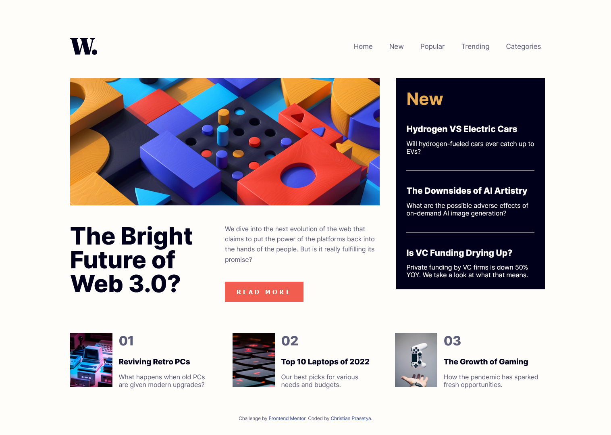

# Frontend Mentor - News homepage solution

This is a solution to the [News homepage challenge on Frontend Mentor](https://www.frontendmentor.io/challenges/news-homepage-H6SWTa1MFl). Frontend Mentor challenges help you improve your coding skills by building realistic projects.

## Table of contents

- [Overview](#overview)
  - [The challenge](#the-challenge)
  - [Screenshot](#screenshot)
  - [Links](#links)
- [My process](#my-process)
  - [Built with](#built-with)
  - [What I learned](#what-i-learned)
  - [Continued development](#continued-development)
  - [Useful resources](#useful-resources)
- [Author](#author)
- [Acknowledgments](#acknowledgments)

**Note: Delete this note and update the table of contents based on what sections you keep.**

## Overview

### The challenge

Users should be able to:

- View the optimal layout for the interface depending on their device's screen size
- See hover and focus states for all interactive elements on the page
- Toggle the mobile menu

### Screenshot

### Links

- Solution URL: [Solution on FrontEnd Mentor](https://www.frontendmentor.io/solutions/responsive-mobile-grid-news-homepage-nqjdQdIoQJ)
- Live Site URL: [The Live Site](https://christian-prasetya.github.io/fem-news_homepage/)

## My process

### Built with

- Semantic HTML5 markup
- Scss/Sass
- CSS custom properties
- CSS Grid
- BEM CSS Method
- Mobile-first workflow
- JavaScript (for the responsive navbar)

### What I learned

What do I learn this time? A lot.

I am learning to create responsive mobile toggle navbar for the first time using vanilla SCSS and JavaScript, when using Bootstrap supposed to be easier choice.

I am learning more about grid layout, it's fun, but also little bit hard to do it right 100%.

## Author

- Instagram - [@cprasetya28](https://www.instagram.com/cprasetya28)
- Frontend Mentor - [@christian-prasetya](https://www.frontendmentor.io/profile/christian-prasetya)
- GitHub - [@christian-prasetya](https://github.com/christian-prasetya)
